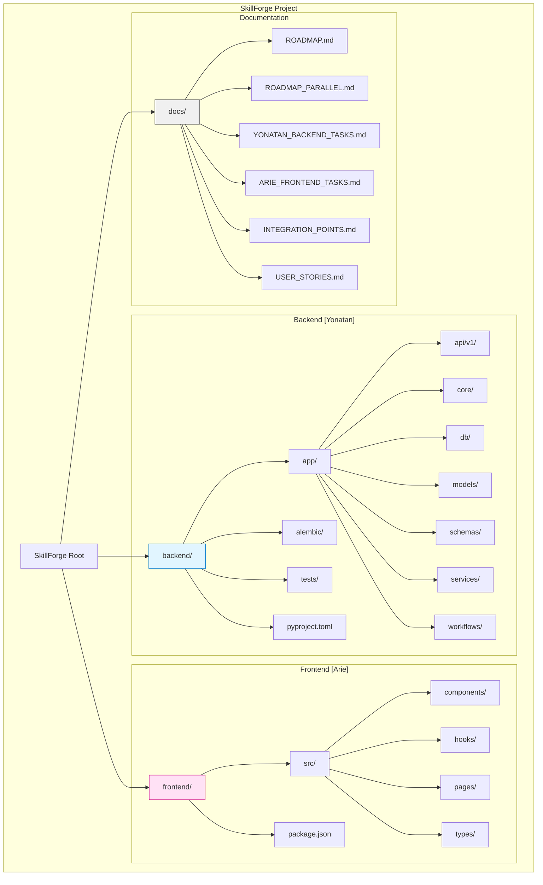
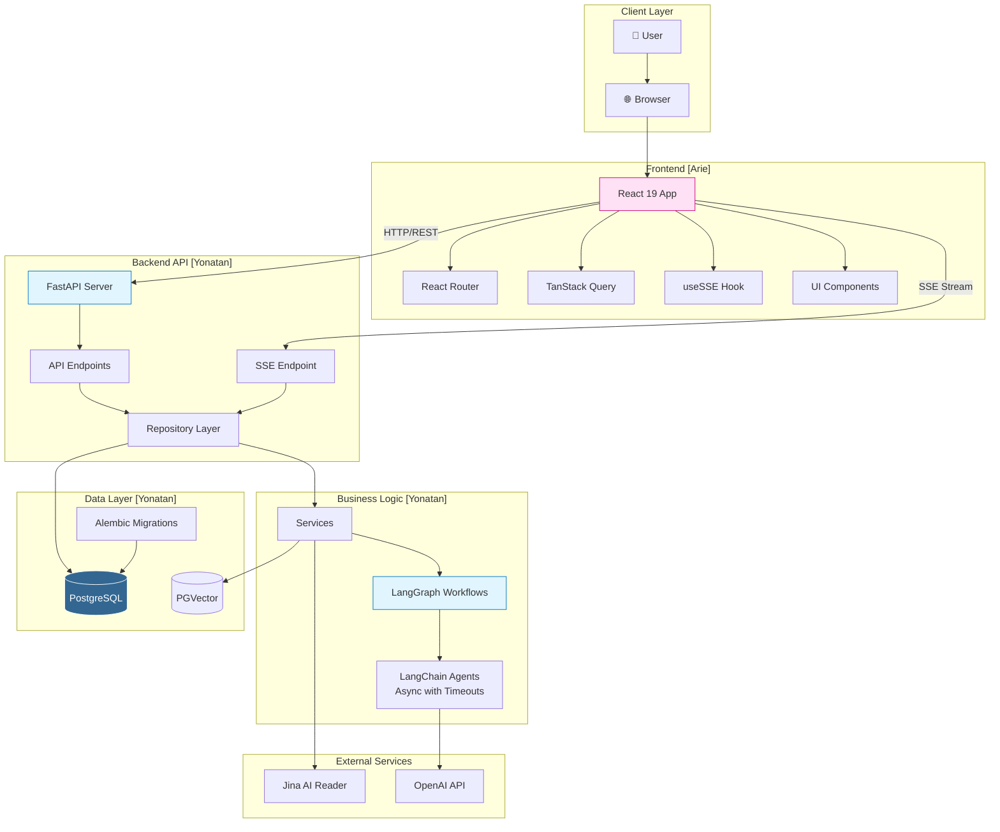
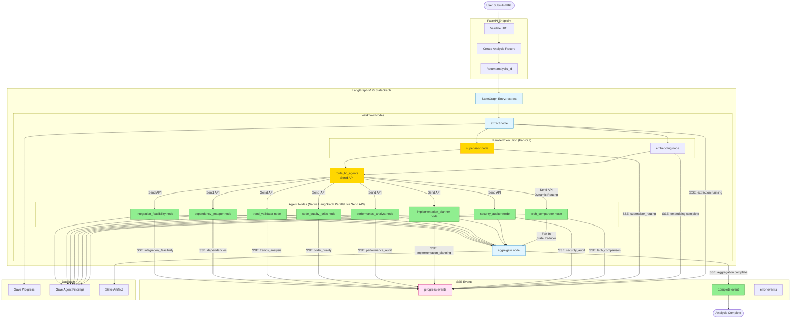
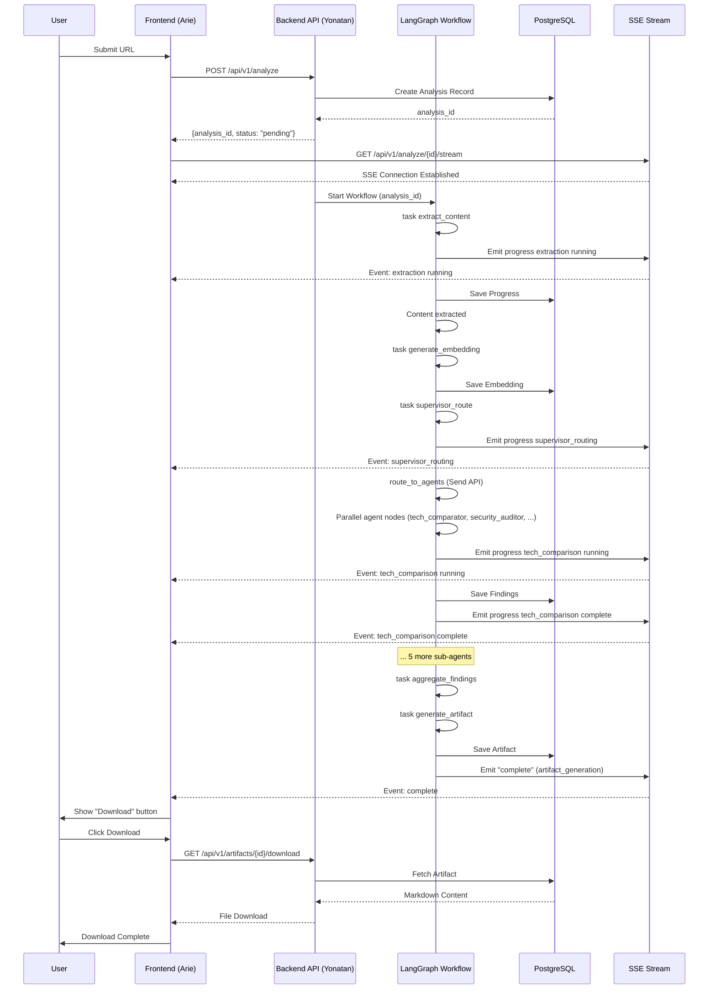
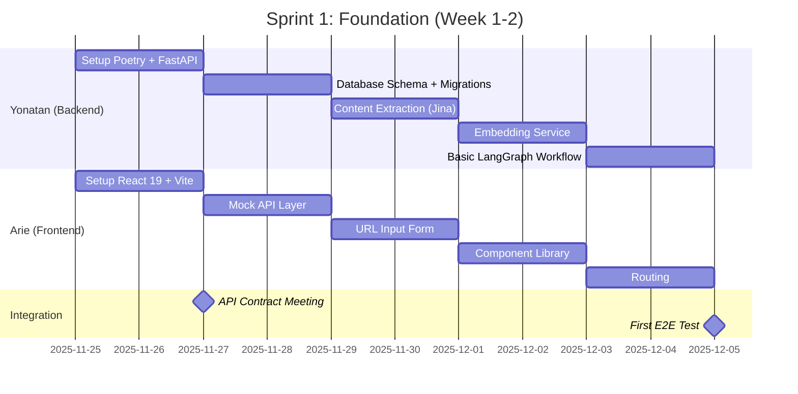
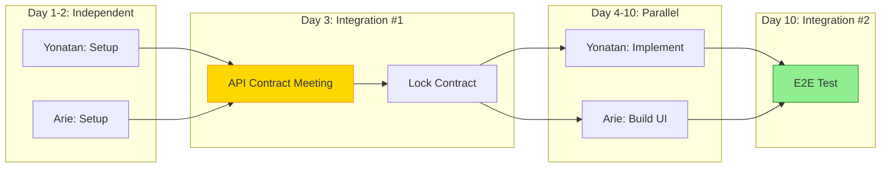
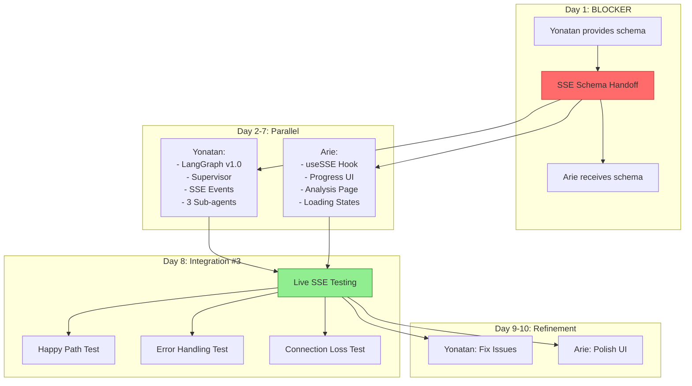
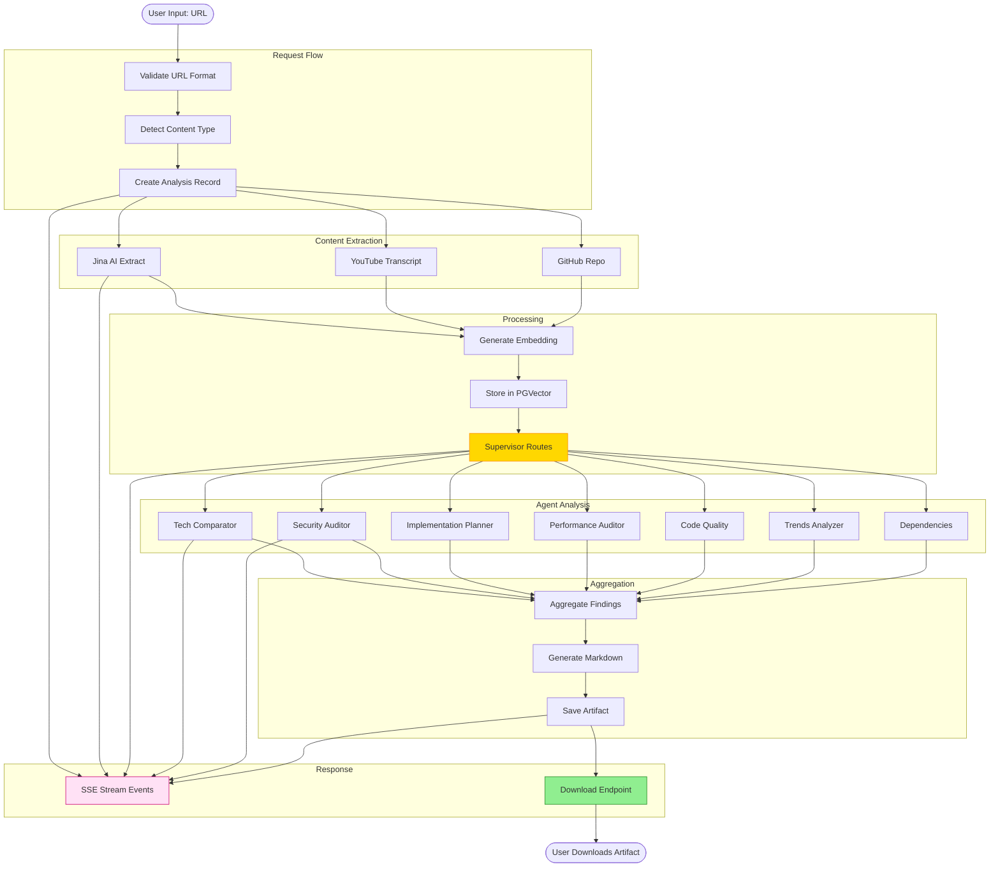
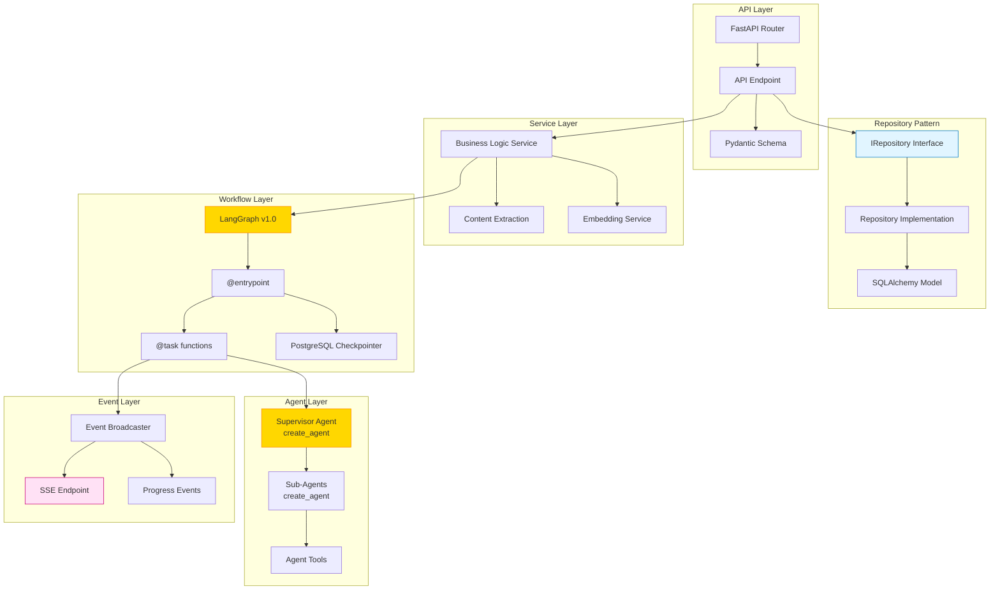

# 🏗️ SkillForge - Architecture & Workflow Diagrams

**Version:** 1.3  
**Last Updated:** December 20, 2025  
**Project:** SkillForge - Research-to-Implementation Pipeline

---

## 📖 Viewing Mermaid Diagrams

This document contains Mermaid diagrams that require a compatible viewer to render properly.

### ✅ Recommended Viewers

1. **VS Code**: Install the "Markdown Preview Mermaid Support" extension
   - Extension ID: `bierner.markdown-mermaid`
   - Press `Cmd+Shift+V` (Mac) or `Ctrl+Shift+V` (Windows/Linux) to preview

2. **GitHub**: Diagrams render automatically when viewing on GitHub.com

3. **Online Viewer**: Copy diagram code to [Mermaid Live Editor](https://mermaid.live/)

4. **Cursor/VS Code**: Use the built-in markdown preview (may require extension)

### 🔧 Quick Fix

If diagrams don't render:
- Open the file in VS Code with the Mermaid extension installed
- Or view on GitHub.com
- Or copy the ```mermaid code blocks to [mermaid.live](https://mermaid.live/)

---

## 📋 Table of Contents

1. [Project Structure](#project-structure)
2. [System Architecture](#system-architecture)
3. [Backend Workflow (LangGraph v1.0)](#backend-workflow-langgraph-v10)
4. [Integration Flow](#integration-flow)
5. [Sprint 1 Workflow](#sprint-1-workflow)
6. [Sprint 2 Workflow](#sprint-2-workflow)
7. [Component Relationships](#component-relationships)
8. [Data Flow](#data-flow)
9. [Deployment Architecture](#deployment-architecture)
10. [Prompt Templating](#prompt-templating)

---

## Project Structure



---

## System Architecture



---

## Backend Workflow (LangGraph v1.0 StateGraph)



---

## Integration Flow



---

## Sprint 1 Workflow





---

## Sprint 2 Workflow



---

## Component Relationships

```mermaid
classDiagram
    class FastAPIEndpoint {
        +POST /api/v1/analyze
        +GET /api/v1/analyze/{id}/stream
        +GET /api/v1/artifacts/{id}/download
    }
    
    class IAnalysisRepository {
        <<interface>>
        +create(url: str) Analysis
        +get_by_id(id: UUID) Analysis
        +list_active() List[Analysis]
    }
    
    class AnalysisRepository {
        -db: AsyncSession
        +create(url: str) Analysis
        +get_by_id(id: UUID) Analysis
        +list_active() List[Analysis]
    }
    
    class AnalysisModel {
        +id: UUID
        +url: str
        +status: str
        +created_at: datetime
    }
    
    class LangGraphWorkflow {
        +entrypoint checkpointer
        +task extract_content
        +task supervisor_route
        +task run_agents
        +task generate_artifact
    }
    
    class SupervisorAgent {
        +create_agent()
        +route(content: str) List[str]
    }
    
    class SubAgent {
        +create_agent()
        +analyze(content: str) dict
    }
    
    class EventBroadcaster {
        +publish(channel: str, event: dict)
        +subscribe(channel: str) AsyncIterator
    }
    
    class SSEEndpoint {
        +stream_analysis_progress(id: UUID)
        +event_generator() AsyncIterator
    }
    
    FastAPIEndpoint --> IAnalysisRepository : depends on
    IAnalysisRepository <|.. AnalysisRepository : implements
    AnalysisRepository --> AnalysisModel : uses
    FastAPIEndpoint --> LangGraphWorkflow : invokes
    LangGraphWorkflow --> SupervisorAgent : uses
    SupervisorAgent --> SubAgent : routes to
    LangGraphWorkflow --> EventBroadcaster : emits events
    EventBroadcaster --> SSEEndpoint : streams to
    SSEEndpoint --> FastAPIEndpoint : returns
    
    style IAnalysisRepository fill:#e1f5ff,stroke:#0077cc
    style LangGraphWorkflow fill:#ffd700,stroke:#ff8c00
    style EventBroadcaster fill:#ffe1f5,stroke:#cc0077
```

---

## Data Flow



---

## Deployment Architecture

```mermaid
graph TB
    subgraph "Development"
        DevUser[Developer]
        DevFrontend[Frontend Dev Server<br/>localhost:5173]
        DevBackend[Backend Dev Server<br/>localhost:8000]
        DevDB[(PostgreSQL Dev<br/>localhost:5432)]
        DevOpenAI[OpenAI API<br/>GPT-5 Mini]
        
        DevUser --> DevFrontend
        DevFrontend --> DevBackend
        DevBackend --> DevDB
        DevBackend --> DevOpenAI
    end
    
    subgraph "Production"
        ProdUser[End Users]
        ProdCDN[Vercel<br/>Frontend (React 19)]
        ProdAPI[Railway<br/>Backend API (FastAPI)]
        ProdDB[(Supabase<br/>PostgreSQL + PGVector)]
        ProdOpenAI[OpenAI API<br/>GPT-5 Mini]
        
        ProdUser --> ProdCDN
        ProdCDN -->|SSE + REST| ProdAPI
        ProdAPI --> ProdDB
        ProdAPI --> ProdOpenAI
    end
    
    subgraph "CI/CD"
        GitHub[GitHub Repository]
        GitHubActions[GitHub Actions]
        Tests[Test Suite]
        Lint[Linting & Type Check]
        Build[Build & Deploy]
        
        GitHub --> GitHubActions
        GitHubActions --> Tests
        GitHubActions --> Lint
        Tests --> Build
        Lint --> Build
        Build --> ProdAPI
        Build --> ProdCDN
    end
    
    style DevFrontend fill:#ffe1f5,stroke:#cc0077
    style DevBackend fill:#e1f5ff,stroke:#0077cc
    style ProdCDN fill:#ffe1f5,stroke:#cc0077
    style ProdAPI fill:#e1f5ff,stroke:#0077cc
    style GitHubActions fill:#90ee90,stroke:#228b22
```

---

## Backend Pattern Architecture



---

## Backend Architecture Patterns

This section documents the key architectural patterns and best practices used in the SkillForge backend.

### Repository Pattern

**Purpose:** Abstract database access and provide a clean interface for data operations.

**Implementation:**
- Repository interfaces define contracts for data operations
- Implementations use SQLAlchemy AsyncSession for database access
- Dependency injection via FastAPI Depends for testability

**Example:**
```python
from app.db.repositories.analysis import IAnalysisRepository, get_analysis_repository

@router.post("/analyze")
async def create_analysis(
    request: AnalyzeRequest,
    repo: IAnalysisRepository = Depends(get_analysis_repository)
) -> AnalyzeResponse:
    analysis = await repo.create(url=request.url)
    return AnalyzeResponse.from_orm(analysis)
```

**Benefits:**
- Testability: Easy to mock repositories in tests
- Maintainability: Database logic isolated from business logic
- Flexibility: Can swap implementations without changing business logic

**Status:** Pattern defined, implementation pending (Issue #41)

### Service Layer

**Purpose:** Encapsulate business logic and coordinate between repositories and external services.

**Responsibilities:**
- Business logic implementation
- External API integration (Jina Reader, OpenAI)
- Data transformation and validation
- Error handling and retry logic

**Current Services:**
- `EmbeddingService`: Generates semantic embeddings using OpenAI (text-embedding-3-small, 1536 dimensions)
- `JinaReader`: Extracts content from URLs
- `EventBroadcaster`: Pub/sub messaging for SSE events

**Pattern:**
```python
class EmbeddingService:
    """Service for generating semantic embeddings."""
    
    async def generate_embedding(self, text: str) -> EmbeddingVector:
        # Business logic here
        # Retry logic, error handling, normalization
        pass
```

### Workflow Orchestration (LangGraph v1.0)

**Purpose:** Orchestrate multi-step analysis workflows with state management and checkpointing.

**Implementation:**
- Uses LangGraph v1.0 Functional API (`@entrypoint`, `@task`)
- PostgreSQL checkpointer for persistent state (production)
- MemorySaver fallback for development
- Thread-based isolation per analysis

**Pattern:**
```python
@task
async def extract_content(url: str, analysis_id: AnalysisID) -> dict:
    """Extract content task."""
    # Task implementation
    pass

@entrypoint(checkpointer=checkpointer)
async def analysis_workflow(input_data: dict) -> dict:
    """Main workflow orchestration."""
    result = await extract_content(input_data["url"], input_data["analysis_id"])
    return result
```

**Benefits:**
- Automatic state persistence
- Workflow resumption after failures
- Clear task boundaries
- Easy to add new tasks

### SSE Event Broadcasting

**Purpose:** Provide real-time progress updates to clients during long-running workflows.

**Architecture:**
- `EventBroadcaster`: In-memory pub/sub using asyncio.Queue
- Channel-based messaging: `workflow:{analysis_id}`
- Automatic cleanup on client disconnect
- Thread-safe with asyncio.Lock

**Flow:**
1. Workflow emits events via `emit_streaming_event()`
2. Events published to broadcaster channel
3. SSE endpoint subscribes to channel
4. Events streamed to connected clients

**Pattern:**
```python
# In workflow
from app.services.sse_helpers import emit_streaming_event

await emit_streaming_event(
    "progress",
    analysis_id=analysis_id,
    stage="extraction",
    status="running",
)

# In SSE endpoint
from app.services.event_broadcaster import broadcaster

async for event in broadcaster.subscribe(f"workflow:{analysis_id}"):
    yield {"event": event["type"], "data": json.dumps(event)}
```

**Event Schema:** See [`docs/issues/040-sse-endpoint/SSE_SCHEMA.md`](../docs/issues/040-sse-endpoint/SSE_SCHEMA.md) for complete event type definitions and TypeScript types.

**Benefits:**
- Real-time user feedback
- No polling required
- Automatic connection management
- Scalable (in-memory, can be extended to Redis)

### Error Handling Strategy

**Purpose:** Provide consistent error handling across the application.

**Exception Hierarchy:**
```
SkillForgeException (base)
├── ServiceException
│   ├── EmbeddingError
│   └── JinaReaderError
├── WorkflowError
└── DatabaseError
```

**Pattern:**
- Custom exceptions inherit from `SkillForgeException`
- Service layer raises specific exceptions
- Global exception handler in FastAPI middleware
- Structured error responses with request IDs

**Implementation:**
```python
# Service raises specific exception
raise EmbeddingError("Embedding generation failed")

# Global handler catches and formats
@app.exception_handler(SkillForgeException)
async def skillforge_exception_handler(request: Request, exc: SkillForgeException):
    return JSONResponse(
        status_code=500,
        content={"error": {"code": type(exc).__name__, "message": str(exc)}}
    )
```

**Benefits:**
- Consistent error responses
- Easy error categorization
- Better debugging with exception types
- Client-friendly error messages

### Database Connection Pooling

**Purpose:** Efficiently manage database connections and prevent connection exhaustion.

**Configuration:**
- `pool_size`: 5 connections maintained
- `max_overflow`: 10 additional connections
- `pool_recycle`: 3600 seconds (1 hour)
- `pool_pre_ping`: Verify connections before use

**Pattern:**
```python
engine = create_async_engine(
    database_url,
    pool_size=DB_POOL_SIZE,
    max_overflow=DB_MAX_OVERFLOW,
    pool_recycle=DB_POOL_RECYCLE,
    pool_pre_ping=True,
)
```

**Benefits:**
- Connection reuse (performance)
- Automatic connection health checks
- Prevents connection leaks
- Handles connection failures gracefully

### Constants Management

**Purpose:** Centralize magic numbers and configuration values.

**Location:** `app/core/constants.py`

**Categories:**
- HTTP status codes
- Timeout values
- Text and message limits
- Retry configuration
- Database pool settings
- Content type constants

**Benefits:**
- Single source of truth
- Easy to update values
- Better code readability
- Type safety

### Type Aliases

**Purpose:** Improve code readability and maintainability with semantic type names.

**Location:** `app/core/types.py`

**Aliases:**
- `EmbeddingVector`: `list[float]`
- `AnalysisID`: `str`
- `ChannelName`: `str`
- `EventData`: `dict[str, object]`
- `ExtractionResult`: `dict[str, str | int | dict[str, str]]`

**Benefits:**
- Self-documenting code
- Easier refactoring
- Better IDE support
- Type safety

---

**Document Maintained By:** Yonatan & Arie  
**Last Updated:** November 28, 2025  

### Viewing Instructions

**To view Mermaid diagrams:**
- **VS Code/Cursor**: Install "Markdown Preview Mermaid Support" extension, then press `Cmd+Shift+V` (Mac) or `Ctrl+Shift+V` (Windows/Linux)
- **GitHub**: View on GitHub.com - diagrams render automatically
- **Online**: Copy any ```mermaid code block to [Mermaid Live Editor](https://mermaid.live/)

**Note**: Plain text editors and some markdown viewers do not support Mermaid rendering. Use one of the recommended viewers above.

