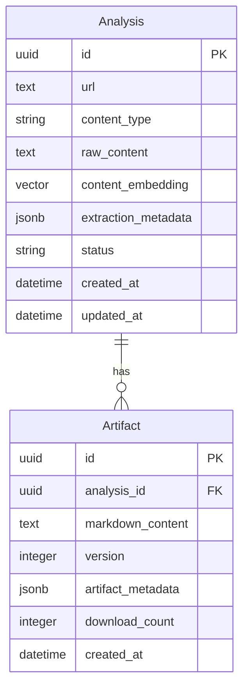
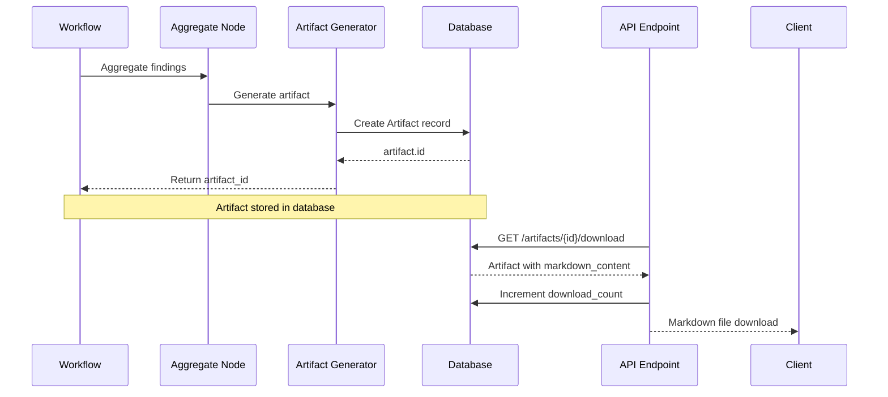

# Artifact Structure & Visualization

## Artifact Model



## Artifact Structure

### Database Schema

```sql
CREATE TABLE artifacts (
    id UUID PRIMARY KEY,
    analysis_id UUID NOT NULL REFERENCES analyses(id) ON DELETE CASCADE,
    markdown_content TEXT NOT NULL,
    version INTEGER NOT NULL DEFAULT 1,
    artifact_metadata JSONB,
    download_count INTEGER NOT NULL DEFAULT 0,
    created_at TIMESTAMP WITH TIME ZONE NOT NULL,
    
    INDEX idx_artifacts_analysis_id (analysis_id)
);
```

### Fields

| Field | Type | Description |
|-------|------|-------------|
| `id` | UUID | Primary key, auto-generated |
| `analysis_id` | UUID | Foreign key to `analyses` table |
| `markdown_content` | TEXT | The full markdown implementation guide (2000-4000 words) |
| `version` | INTEGER | Artifact version (starts at 1, for future updates) |
| `artifact_metadata` | JSONB | Metadata like topics, tags, complexity score |
| `download_count` | INTEGER | Number of times artifact was downloaded |
| `created_at` | TIMESTAMP | When artifact was created |

### Artifact Metadata Structure

The `artifact_metadata` JSONB field contains:

```json
{
  "topics": ["react", "streaming", "ssr"],
  "tags": ["frontend", "performance"],
  "complexity_score": 7.5,
  "estimated_read_time_minutes": 15,
  "sections": [
    "Executive Summary",
    "Key Findings",
    "Technical Analysis",
    "Implementation Plan",
    "Claude Code Prompt"
  ]
}
```

## Markdown Content Structure

Artifacts contain markdown with the following typical structure:

```markdown
# Implementation Guide: [Title]

## Executive Summary
[2-3 sentence overview]

## Key Findings
- Finding 1
- Finding 2
- Finding 3

## Technical Analysis
[Detailed technical analysis from agent findings]

## Implementation Plan
[Step-by-step implementation guide]

## Claude Code Prompt
[Copyable prompt for Claude Code]

## Considerations
[Important caveats, limitations, alternatives]

## References
[Links to original content, documentation, etc.]
```

## Visualizing Artifacts

### Using the Visualization Script

```bash
# View latest artifact
python backend/scripts/visualize_artifact.py --latest

# View by artifact ID
python backend/scripts/visualize_artifact.py --artifact-id <uuid>

# View by analysis ID
python backend/scripts/visualize_artifact.py --analysis-id <uuid>

# Show full markdown content
python backend/scripts/visualize_artifact.py --artifact-id <uuid> --full

# Save to file
python backend/scripts/visualize_artifact.py --artifact-id <uuid> --save output.md
```

### What the Script Shows

1. **Artifact Information**
   - ID, Analysis ID
   - Version, Created At
   - Download Count
   - Content size (human-readable)
   - Line count

2. **Metadata**
   - Topics, tags, complexity
   - JSON representation

3. **Markdown Structure**
   - Number of headings
   - Code blocks count
   - Links count
   - List items
   - Tables
   - Document outline (heading hierarchy)

4. **Content Preview**
   - First 50 lines of markdown
   - Full content with `--full` flag

### Example Output

```
================================================================================
  ARTIFACT VISUALIZATION
================================================================================

================================================================================
  Artifact Information
================================================================================
  ID:              123e4567-e89b-12d3-a456-426614174000
  Analysis ID:     abc12345-e89b-12d3-a456-426614174000
  Version:         1
  Created At:      2025-01-15 10:30:00+00:00
  Download Count:  5
  Content Size:    45.2 KB
  Line Count:      523

  Metadata:
  {
      "topics": ["react", "streaming"],
      "complexity_score": 7.5
  }

================================================================================
  Markdown Structure
================================================================================
  Headings:        12
  Code Blocks:     8
  Links:           15
  List Items:      45
  Tables:          2

  Document Outline:
  # Implementation Guide: React 19 Streaming SSR
    ## Executive Summary
      ### Overview
    ## Key Findings
    ## Technical Analysis
    ...
```

## Accessing Artifacts Programmatically

### Using Repository Pattern

```python
from app.db.repositories.artifact_repository import ArtifactRepository
from app.db.session import AsyncSessionLocal
import uuid

async def get_artifact(artifact_id: str):
    async with AsyncSessionLocal() as db:
        repo = ArtifactRepository(session=db)
        artifact = await repo.get_artifact_by_id(uuid.UUID(artifact_id))
        
        if artifact:
            print(f"Content: {artifact.markdown_content[:100]}...")
            print(f"Size: {len(artifact.markdown_content)} chars")
            print(f"Metadata: {artifact.artifact_metadata}")
```

### Via API Endpoint

```bash
# Download artifact as markdown file
curl http://localhost:8500/api/v1/artifacts/{artifact_id}/download \
  --output artifact.md

# The endpoint automatically:
# - Returns markdown with proper Content-Disposition header
# - Increments download_count
# - Includes filename in headers
```

## Artifact Lifecycle



## Best Practices

1. **Versioning**: Start at version 1, increment for updates
2. **Metadata**: Store searchable topics and tags in `artifact_metadata`
3. **Size**: Keep markdown content readable (2000-4000 words typical)
4. **Format**: Use proper markdown with code blocks, headings, links
5. **Analytics**: Track downloads via `download_count`

