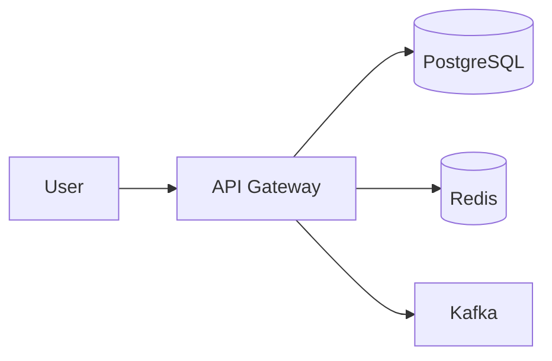

# 🟣 Multimodal Intelligence Milestone

> **Milestone Type**: Feature Expansion
> **Version**: 3.1.0
> **Status**: Proposed Milestone
> **Prerequisites**: #299-304 (Triple-Consumer Artifacts) Complete
> **Last Updated**: December 14, 2025
> **Estimated Issues**: 25-30 GitHub issues
> **Estimated Duration**: 6-8 weeks

---

## Executive Summary

This document defines the **Multimodal Intelligence** milestone - a comprehensive expansion of SkillForge's analysis capabilities to include **image extraction, vision analysis, and visual search**. This follows SkillForge's data-first methodology with golden datasets, evaluation pipelines, and 80%+ test coverage before production deployment.

---

## Table of Contents

1. [Milestone Position in Roadmap](#1-milestone-position-in-roadmap)
2. [Data-First Approach: Golden Datasets & Evals](#2-data-first-approach-golden-datasets--evals)
3. [Testing Strategy](#3-testing-strategy)
4. [Claude Code Integration (Skills & Sub-Agents)](#4-claude-code-integration-skills--sub-agents)
5. [Implementation Phases](#5-implementation-phases)
6. [GitHub Issues Breakdown](#6-github-issues-breakdown)
7. [Schema Extensions](#7-schema-extensions)
8. [LangGraph Pipeline Updates](#8-langgraph-pipeline-updates)
9. [Vision Model Strategy](#9-vision-model-strategy)
10. [Cost & Performance Targets](#10-cost--performance-targets)
11. [Documentation Updates](#11-documentation-updates)
12. [Success Criteria](#12-success-criteria)
13. [References](#13-references)

---

## 1. Milestone Position in Roadmap

```
╔══════════════════════════════════════════════════════════════════════════════════════════╗
║                              SKILLFORGE MILESTONE ROADMAP                                 ║
║                                    (December 2025)                                        ║
╠══════════════════════════════════════════════════════════════════════════════════════════╣
║                                                                                           ║
║  ✅ COMPLETED                                                                             ║
║  ───────────                                                                              ║
║  ☑️  Sprints 1-8: Foundation → Embeddings & Search                                        ║
║  ☑️  MCP Consumer: PR #262 (27 pts)                                                       ║
║  ☑️  Context Engineering: PR #265, #277                                                   ║
║                                                                                           ║
║  🔴 E2E Test Infrastructure (4 issues)  ────────────────────────────┐                    ║
║      Fix tests, seed data                                           │                    ║
║                                                                     │                    ║
║  🟠 Evaluation Pipeline (5 issues) ─────────────────────────────────┤                    ║
║      #257 done - Quality gates, CI/CD                               │                    ║
║                                                                     │                    ║
║  🟡 Triple-Consumer Artifacts (#299-304) ───────────────────────────┤  CURRENT PATH     ║
║      Schema, prompts, templates for 3 consumers                     │                    ║
║                                                                     │                    ║
║  🔵 Production Deployment (20 issues) ──────────────────────────────┘                    ║
║      Railway + Supabase + Vercel                                                          ║
║                                                                                           ║
║  ════════════════════════════════════════════════════════════════════════════════════    ║
║                                    GATE: Production v1.0                                  ║
║  ════════════════════════════════════════════════════════════════════════════════════    ║
║                                                                                           ║
║  ⚪ MCP Server (5 issues) ──────────────────────────────────────────┐                    ║
║      Expose tools via MCP                                           │  POST-LAUNCH       ║
║                                                                     │                    ║
║  🟣 MULTIMODAL INTELLIGENCE (25-30 issues) ◄─── THIS MILESTONE ────┤                    ║
║      Vision analysis, image search, visual evals                    │                    ║
║                                                                     │                    ║
║  📦 Content Expansion (5 issues) ───────────────────────────────────┘                    ║
║      YouTube & GitHub enhancements                                                        ║
║                                                                                           ║
╚══════════════════════════════════════════════════════════════════════════════════════════╝
```

### Milestone Dependencies

```
#299-304 (Triple-Consumer)
        │
        ▼
┌───────────────────────────────────────────────────────────────┐
│   GATE: Phase 1 Complete                                      │
│   • AggregatedInsights schema finalized (#302)                │
│   • Synthesis prompt working (#303)                           │
│   • Artifact template rendering (#304)                        │
│   • Quality gate operational (#301)                           │
│   • Memory recall working (#300)                              │
└───────────────────────────────────────────────────────────────┘
        │
        ▼
🟣 Multimodal Intelligence Milestone
```

---

## 2. Data-First Approach: Golden Datasets & Evals

### 2.1 Visual Golden Dataset

**Location**: `backend/data/visual_golden_dataset/`

```
backend/data/visual_golden_dataset/
├── README.md                      # Dataset documentation
├── metadata.json                  # Stats and versioning
├── images/                        # Curated image files
│   ├── architecture/              # 30+ architecture diagrams
│   ├── flowcharts/                # 20+ flowcharts
│   ├── screenshots/               # 20+ code/UI screenshots
│   ├── charts/                    # 15+ data visualizations
│   └── edge_cases/                # 15+ challenging cases
├── annotations/                   # Ground truth labels
│   ├── classifications.json       # Image type labels
│   ├── entities.json              # Extracted entities per image
│   ├── relationships.json         # Entity relationships
│   └── mermaid_recreations.json   # Hand-crafted Mermaid for diagrams
└── evaluation_sets/
    ├── classification_eval.json   # For classifier testing
    ├── extraction_eval.json       # For entity extraction testing
    └── search_eval.json           # For visual search testing
```

### 2.2 Dataset Curation Process

```
╔══════════════════════════════════════════════════════════════════════════════════════════╗
║                          VISUAL GOLDEN DATASET PIPELINE                                   ║
╠══════════════════════════════════════════════════════════════════════════════════════════╣
║                                                                                           ║
║  PHASE 1: Collection (Week 1)                                                             ║
║  ═══════════════════════════                                                              ║
║                                                                                           ║
║  ┌─────────────────────┐     ┌─────────────────────┐     ┌─────────────────────┐         ║
║  │   Source: Existing  │     │   Source: Public    │     │   Source: Manual    │         ║
║  │   Golden Dataset    │     │   Tech Blogs        │     │   Screenshots       │         ║
║  │   (96 analyses)     │     │   (Weaviate, etc)   │     │   (VSCode, etc)     │         ║
║  └─────────┬───────────┘     └─────────┬───────────┘     └─────────┬───────────┘         ║
║            │                           │                           │                      ║
║            └───────────────────────────┴───────────────────────────┘                      ║
║                                        │                                                  ║
║                                        ▼                                                  ║
║                           ┌────────────────────────┐                                      ║
║                           │   Image Extraction     │                                      ║
║                           │   • BeautifulSoup      │                                      ║
║                           │   • Quality filtering  │                                      ║
║                           │   • Deduplication      │                                      ║
║                           └────────────┬───────────┘                                      ║
║                                        │                                                  ║
║                                        ▼                                                  ║
║  PHASE 2: Annotation (Week 2)                                                             ║
║  ════════════════════════════                                                             ║
║                                                                                           ║
║  ┌─────────────────────────────────────────────────────────────────────────────────────┐ ║
║  │  ANNOTATION INTERFACE (Streamlit/Label Studio)                                      │ ║
║  │  ──────────────────────────────────────────────                                     │ ║
║  │                                                                                     │ ║
║  │  For each image:                                                                    │ ║
║  │  ┌───────────────┐  ┌───────────────┐  ┌───────────────┐  ┌───────────────┐        │ ║
║  │  │ Classification│  │   Entities    │  │ Relationships │  │    Mermaid    │        │ ║
║  │  │ • architecture│  │ • components  │  │ • flows       │  │ • recreation  │        │ ║
║  │  │ • flowchart   │  │ • services    │  │ • dependencies│  │ (if diagram)  │        │ ║
║  │  │ • screenshot  │  │ • databases   │  │ • data paths  │  │               │        │ ║
║  │  │ • chart       │  │ • APIs        │  │               │  │               │        │ ║
║  │  └───────────────┘  └───────────────┘  └───────────────┘  └───────────────┘        │ ║
║  │                                                                                     │ ║
║  │  Annotators: 2 humans + 1 LLM (consensus required)                                 │ ║
║  └─────────────────────────────────────────────────────────────────────────────────────┘ ║
║                                        │                                                  ║
║                                        ▼                                                  ║
║  PHASE 3: Validation (Week 3)                                                             ║
║  ════════════════════════════                                                             ║
║                                                                                           ║
║  ┌─────────────────────┐     ┌─────────────────────┐     ┌─────────────────────┐         ║
║  │  Inter-Annotator    │     │   LLM Validation    │     │   Expert Review     │         ║
║  │  Agreement (IAA)    │     │   (Claude Opus 4.5) │     │   (Final 20%)       │         ║
║  │  Cohen's κ ≥ 0.8    │     │   Consensus check   │     │   Edge cases        │         ║
║  └─────────────────────┘     └─────────────────────┘     └─────────────────────┘         ║
║                                                                                           ║
║  Target: 100+ annotated images with ≥85% agreement                                       ║
║                                                                                           ║
╚══════════════════════════════════════════════════════════════════════════════════════════╝
```

### 2.3 Evaluation Framework

**Location**: `backend/app/evaluation/evaluators/visual/`

```python
# backend/app/evaluation/evaluators/visual/__init__.py

"""Visual evaluation metrics for multimodal pipeline."""

from .classification_accuracy import ClassificationEvaluator
from .entity_extraction import EntityExtractionEvaluator
from .relationship_detection import RelationshipEvaluator
from .visual_search import VisualSearchEvaluator
from .mermaid_quality import MermaidQualityEvaluator

__all__ = [
    "ClassificationEvaluator",
    "EntityExtractionEvaluator",
    "RelationshipEvaluator",
    "VisualSearchEvaluator",
    "MermaidQualityEvaluator",
]
```

### 2.4 Evaluation Metrics

| Metric | Target | Measurement |
|--------|--------|-------------|
| **Classification Accuracy** | ≥90% | SigLIP 2 vs golden labels |
| **Entity Extraction F1** | ≥0.85 | Precision/Recall on entities |
| **Relationship Detection F1** | ≥0.75 | Edge detection in diagrams |
| **Visual Search MRR** | ≥0.80 | Mean Reciprocal Rank |
| **Mermaid Recreation BLEU** | ≥0.60 | Similarity to ground truth |

### 2.5 LangSmith Integration

```python
# backend/app/evaluation/visual_benchmark.py

"""Visual benchmark runner integrated with LangSmith."""

from langsmith import Client
from langsmith.evaluation import evaluate

class VisualBenchmark:
    """Run visual evaluation experiments with LangSmith tracking."""

    def __init__(self, dataset_name: str = "visual-golden-v1"):
        self.client = Client()
        self.dataset_name = dataset_name

    async def run_classification_benchmark(
        self,
        models: list[str] = ["siglip2", "openvision", "gemini-flash"],
    ) -> dict:
        """Benchmark classification across models."""
        results = await evaluate(
            lambda x: self.classify_image(x),
            data=self.dataset_name,
            evaluators=[
                ClassificationEvaluator(),
                LatencyEvaluator(),
                CostEvaluator(),
            ],
            experiment_prefix="visual-classification",
        )
        return results

    async def run_entity_extraction_benchmark(
        self,
        models: list[str] = ["claude-opus-4.5", "gpt-5.2", "gemini-3-pro"],
    ) -> dict:
        """Benchmark entity extraction across vision models."""
        # ... similar structure
```

### 2.6 Regression Detection

```python
# backend/app/evaluation/metrics/visual_regression.py

"""Visual regression detection for CI/CD pipeline."""

from dataclasses import dataclass

@dataclass
class VisualRegressionThresholds:
    """Thresholds for visual regression detection."""

    classification_accuracy_min: float = 0.88  # 2% tolerance from 90%
    entity_f1_min: float = 0.82                # 3% tolerance from 85%
    search_mrr_min: float = 0.77               # 3% tolerance from 80%
    latency_p95_max_ms: int = 3000             # 3 seconds max
    cost_per_image_max: float = 0.01           # $0.01 max

def check_visual_regression(
    current: dict,
    baseline: dict,
    thresholds: VisualRegressionThresholds = None,
) -> tuple[bool, list[str]]:
    """Check if current results regressed from baseline."""
    # Returns (passed, list of failure reasons)
```

---

## 3. Testing Strategy

### 3.1 Test Coverage Requirements

| Component | Min Coverage | Notes |
|-----------|-------------|-------|
| Image Extractor | 90% | Core extraction logic |
| Vision Analyzer | 85% | Model integration |
| Visual Schemas | 95% | Pydantic models |
| Search Service | 85% | PGVector queries |
| LangGraph Nodes | 80% | Workflow nodes |
| **Overall Visual Module** | **80%** | Hard gate |

### 3.2 Test Structure

```
backend/tests/
├── unit/
│   └── evaluation/
│       └── visual/
│           ├── test_classification_evaluator.py
│           ├── test_entity_extraction.py
│           ├── test_visual_search_metrics.py
│           └── test_mermaid_quality.py
│   └── services/
│       └── visual/
│           ├── test_image_extractor.py
│           ├── test_image_classifier.py
│           ├── test_vision_analyzer.py
│           └── test_visual_embeddings.py
│   └── workflows/
│       └── nodes/
│           ├── test_image_extractor_node.py
│           └── test_vision_analyzer_node.py
├── integration/
│   └── visual/
│       ├── test_extraction_pipeline.py
│       ├── test_vision_model_integration.py
│       ├── test_visual_search_e2e.py
│       └── test_multimodal_artifact_generation.py
├── e2e/
│   └── visual/
│       ├── test_analyze_url_with_images.py
│       ├── test_visual_search_api.py
│       └── test_artifact_with_diagrams.py
└── smoke/
    └── visual/
        ├── test_siglip_model_load.py
        ├── test_vision_api_connectivity.py
        └── test_image_storage.py
```

### 3.3 Test Categories

```
╔══════════════════════════════════════════════════════════════════════════════════════════╗
║                              VISUAL TESTING PYRAMID                                       ║
╠══════════════════════════════════════════════════════════════════════════════════════════╣
║                                                                                           ║
║                                    ┌─────────┐                                            ║
║                                    │   E2E   │   5 tests                                 ║
║                                    │ Playwright│  ~10 min                                ║
║                                    └────┬────┘                                            ║
║                                         │                                                 ║
║                               ┌─────────┴─────────┐                                       ║
║                               │    Integration    │   15 tests                           ║
║                               │   Real models +   │   ~5 min                             ║
║                               │   Real DB         │                                       ║
║                               └─────────┬─────────┘                                       ║
║                                         │                                                 ║
║                    ┌────────────────────┴────────────────────┐                           ║
║                    │              Unit Tests                  │   50+ tests              ║
║                    │   Mocked models, isolated components     │   ~30 sec               ║
║                    └────────────────────┬────────────────────┘                           ║
║                                         │                                                 ║
║            ┌────────────────────────────┴────────────────────────────┐                   ║
║            │                     Smoke Tests                          │   8 tests        ║
║            │   Model loading, API connectivity, storage access        │   ~10 sec        ║
║            └──────────────────────────────────────────────────────────┘                   ║
║                                                                                           ║
║  CI Pipeline:                                                                             ║
║  1. Smoke tests (every push) - fast fail                                                 ║
║  2. Unit tests (every push) - coverage gate                                              ║
║  3. Integration (every PR) - real model tests                                            ║
║  4. E2E (nightly + release) - full visual flow                                           ║
║                                                                                           ║
╚══════════════════════════════════════════════════════════════════════════════════════════╝
```

### 3.4 Fixtures & Mocks

```python
# backend/tests/fixtures/visual_fixtures.py

"""Fixtures for visual testing."""

import pytest
from pathlib import Path

@pytest.fixture
def sample_architecture_diagram() -> bytes:
    """Load sample architecture diagram for testing."""
    return (Path(__file__).parent / "data" / "arch_diagram.png").read_bytes()

@pytest.fixture
def mock_siglip_classifier():
    """Mock SigLIP classifier for unit tests."""
    class MockClassifier:
        async def classify(self, image: bytes) -> dict:
            return {
                "classification": "architecture",
                "confidence": 0.95,
                "is_informational": True,
            }
    return MockClassifier()

@pytest.fixture
def mock_vision_model():
    """Mock vision model (Claude/GPT/Gemini) for unit tests."""
    class MockVisionModel:
        async def analyze(self, image: bytes, prompt: str) -> dict:
            return {
                "description": "System architecture showing microservices",
                "entities": [
                    {"name": "API Gateway", "type": "service"},
                    {"name": "PostgreSQL", "type": "database"},
                ],
                "relationships": [
                    {"source": "API Gateway", "target": "PostgreSQL", "type": "connects"}
                ],
            }
    return MockVisionModel()
```

---

## 4. Claude Code Integration (Skills & Sub-Agents)

### 4.1 New Skill: `multimodal-vision`

**Location**: `.claude/skills/multimodal-vision/`

```
.claude/skills/multimodal-vision/
├── SKILL.md                       # Main skill documentation
├── capabilities.json              # Progressive loading index
├── references/
│   ├── siglip-classification.md   # SigLIP 2 usage guide
│   ├── vision-model-routing.md    # Model selection logic
│   ├── visual-search.md           # PGVector visual queries
│   └── mermaid-recreation.md      # Diagram → Mermaid conversion
└── templates/
    ├── vision_analysis_prompt.md  # Analysis prompt template
    ├── entity_extraction.md       # Entity extraction prompt
    └── diagram_interpretation.md  # Diagram explanation prompt
```

**capabilities.json**:
```json
{
  "skill": "multimodal-vision",
  "version": "1.0.0",
  "capabilities": [
    {
      "name": "image_classification",
      "keywords": ["classify", "categorize", "image type"],
      "examples": ["What type of image is this?", "Is this a diagram?"],
      "reference": "references/siglip-classification.md"
    },
    {
      "name": "diagram_analysis",
      "keywords": ["diagram", "architecture", "flowchart", "analyze"],
      "examples": ["Explain this architecture diagram", "What components are shown?"],
      "reference": "references/vision-model-routing.md"
    },
    {
      "name": "visual_search",
      "keywords": ["find", "search", "similar", "images like"],
      "examples": ["Find diagrams like this", "Show similar architectures"],
      "reference": "references/visual-search.md"
    },
    {
      "name": "mermaid_recreation",
      "keywords": ["mermaid", "recreate", "code", "diagram code"],
      "examples": ["Convert this diagram to Mermaid", "Generate code for this flowchart"],
      "reference": "references/mermaid-recreation.md"
    }
  ]
}
```

### 4.2 Updated Sub-Agent: Vision Analyzer

**Location**: `.claude/agents/vision_analyzer.md`

```markdown
# Vision Analyzer Agent

## Identity
You are a Vision Analyzer specialist for SkillForge, responsible for extracting
insights from technical diagrams, screenshots, and visualizations.

## Capabilities
- Classify images (architecture, flowchart, screenshot, chart)
- Extract entities (services, databases, APIs, components)
- Identify relationships and data flows
- Generate Mermaid code recreations
- Provide educational explanations

## Tools Available
- `siglip_classify`: Fast local classification (SigLIP 2)
- `vision_analyze`: Deep analysis (Claude Opus 4.5 / GPT-5.2 / Gemini 3 Pro)
- `mermaid_generate`: Diagram → Mermaid conversion

## Output Format
Return structured JSON matching `VisualAnalysis` schema:
```json
{
  "classification": "architecture",
  "confidence": 0.95,
  "description": "...",
  "entities": [...],
  "relationships": [...],
  "mermaid_code": "...",
  "educational_notes": {...}
}
```

## When to Route Here
- Content contains technical diagrams
- User asks about visual elements
- Artifact needs diagram explanations
```

### 4.3 New Slash Command: `/analyze-diagram`

**Location**: `.claude/commands/analyze-diagram.md`

```markdown
# Analyze Diagram Command

Analyze a technical diagram image and provide detailed insights.

## Usage
```
/analyze-diagram <image_path_or_url>
```

## What It Does
1. Downloads/loads the image
2. Classifies the diagram type
3. Extracts entities and relationships
4. Generates Mermaid recreation (if applicable)
5. Provides educational explanation

## Example Output
```
## Diagram Analysis

**Type**: Architecture Diagram (95% confidence)

### Components Identified
- API Gateway (service)
- PostgreSQL (database)
- Redis (cache)
- Kafka (message queue)

### Data Flow
User → API Gateway → PostgreSQL
API Gateway → Redis (caching)
API Gateway → Kafka (async events)

### Mermaid Recreation


### Educational Notes
This architecture follows the **API Gateway pattern**...
```
```

### 4.4 Agent Registry Update

**Location**: `.claude/agent-registry.json`

```json
{
  "agents": [
    // ... existing agents ...
    {
      "name": "vision_analyzer",
      "description": "Analyzes technical diagrams and visual content",
      "can_solve_examples": [
        "Explain this architecture diagram",
        "What components are in this image?",
        "Convert this flowchart to Mermaid",
        "Find similar diagrams in the library"
      ],
      "skills_used": ["multimodal-vision"],
      "triggers": {
        "keywords": ["diagram", "image", "visual", "screenshot", "flowchart"],
        "content_types": ["image/*"],
        "url_patterns": ["*.png", "*.jpg", "*.svg"]
      }
    }
  ]
}
```

---

## 5. Implementation Phases

```
╔══════════════════════════════════════════════════════════════════════════════════════════╗
║                        MULTIMODAL INTELLIGENCE IMPLEMENTATION                             ║
║                                    (6-8 Weeks)                                            ║
╠══════════════════════════════════════════════════════════════════════════════════════════╣
║                                                                                           ║
║  ┌─────────────────────────────────────────────────────────────────────────────────────┐ ║
║  │  PHASE 1: DATA FOUNDATION (Weeks 1-2)                                               │ ║
║  │  ════════════════════════════════════                                               │ ║
║  │                                                                                     │ ║
║  │  Issues: #309-313 (5 issues)                                                        │ ║
║  │                                                                                     │ ║
║  │  ┌────────────┐  ┌────────────┐  ┌────────────┐  ┌────────────┐  ┌────────────┐    │ ║
║  │  │   #309     │  │   #310     │  │   #311     │  │   #312     │  │   #313     │    │ ║
║  │  │  Visual    │  │ Annotation │  │  Golden    │  │   Eval     │  │ LangSmith  │    │ ║
║  │  │  Dataset   │  │ Interface  │  │  Dataset   │  │ Framework  │  │Integration │    │ ║
║  │  │ Collection │  │ (Streamlit)│  │ Validation │  │  Setup     │  │            │    │ ║
║  │  └────────────┘  └────────────┘  └────────────┘  └────────────┘  └────────────┘    │ ║
║  │                                                                                     │ ║
║  │  Deliverables:                                                                      │ ║
║  │  ✓ 100+ curated images with annotations                                            │ ║
║  │  ✓ Annotation interface operational                                                │ ║
║  │  ✓ Inter-annotator agreement ≥0.8                                                  │ ║
║  │  ✓ Evaluation framework running in CI                                              │ ║
║  │                                                                                     │ ║
║  └─────────────────────────────────────────────────────────────────────────────────────┘ ║
║                                          │                                               ║
║                                          ▼                                               ║
║  ┌─────────────────────────────────────────────────────────────────────────────────────┐ ║
║  │  PHASE 2: EXTRACTION INFRASTRUCTURE (Weeks 2-3)                                     │ ║
║  │  ══════════════════════════════════════════════                                     │ ║
║  │                                                                                     │ ║
║  │  Issues: #314-318 (5 issues)                                                        │ ║
║  │                                                                                     │ ║
║  │  ┌────────────┐  ┌────────────┐  ┌────────────┐  ┌────────────┐  ┌────────────┐    │ ║
║  │  │   #314     │  │   #315     │  │   #316     │  │   #317     │  │   #318     │    │ ║
║  │  │  Database  │  │  Image     │  │ Perceptual │  │  Quality   │  │  Storage   │    │ ║
║  │  │ Migration  │  │ Extractor  │  │   Hash     │  │ Filtering  │  │Abstraction │    │ ║
║  │  │            │  │  Service   │  │   Dedup    │  │            │  │  (→ S3)    │    │ ║
║  │  └────────────┘  └────────────┘  └────────────┘  └────────────┘  └────────────┘    │ ║
║  │                                                                                     │ ║
║  │  Deliverables:                                                                      │ ║
║  │  ✓ media_assets, visual_analyses tables                                            │ ║
║  │  ✓ Image extraction from HTML content                                              │ ║
║  │  ✓ Duplicate detection via perceptual hash                                         │ ║
║  │  ✓ Quality filtering (size, aspect ratio)                                          │ ║
║  │  ✓ Test coverage ≥80%                                                              │ ║
║  │                                                                                     │ ║
║  └─────────────────────────────────────────────────────────────────────────────────────┘ ║
║                                          │                                               ║
║                                          ▼                                               ║
║  ┌─────────────────────────────────────────────────────────────────────────────────────┐ ║
║  │  PHASE 3: VISION ANALYSIS (Weeks 3-5)                                               │ ║
║  │  ════════════════════════════════════                                               │ ║
║  │                                                                                     │ ║
║  │  Issues: #319-326 (8 issues)                                                        │ ║
║  │                                                                                     │ ║
║  │  ┌────────────┐  ┌────────────┐  ┌────────────┐  ┌────────────┐                    │ ║
║  │  │   #319     │  │   #320     │  │   #321     │  │   #322     │                    │ ║
║  │  │  SigLIP 2  │  │  Vision    │  │ Structured │  │  Tiered    │                    │ ║
║  │  │ Classifier │  │  Model     │  │  Output    │  │ Processing │                    │ ║
║  │  │            │  │  Router    │  │  Parsing   │  │            │                    │ ║
║  │  └────────────┘  └────────────┘  └────────────┘  └────────────┘                    │ ║
║  │                                                                                     │ ║
║  │  ┌────────────┐  ┌────────────┐  ┌────────────┐  ┌────────────┐                    │ ║
║  │  │   #323     │  │   #324     │  │   #325     │  │   #326     │                    │ ║
║  │  │ LangGraph  │  │  Schema    │  │ Template   │  │  Prompt    │                    │ ║
║  │  │  9th Agent │  │ Extension  │  │ Extension  │  │ Extension  │                    │ ║
║  │  │   Node     │  │  (#302)    │  │  (#304)    │  │  (#303)    │                    │ ║
║  │  └────────────┘  └────────────┘  └────────────┘  └────────────┘                    │ ║
║  │                                                                                     │ ║
║  │  Deliverables:                                                                      │ ║
║  │  ✓ Local SigLIP 2 classifier (20-30ms)                                             │ ║
║  │  ✓ Vision model router (Claude/GPT/Gemini)                                         │ ║
║  │  ✓ Vision analyzer as 9th LangGraph agent                                          │ ║
║  │  ✓ AggregatedInsights.visual_insights field                                        │ ║
║  │  ✓ Artifact template with diagram sections                                         │ ║
║  │  ✓ Classification accuracy ≥90%                                                    │ ║
║  │                                                                                     │ ║
║  └─────────────────────────────────────────────────────────────────────────────────────┘ ║
║                                          │                                               ║
║                                          ▼                                               ║
║  ┌─────────────────────────────────────────────────────────────────────────────────────┐ ║
║  │  PHASE 4: VISUAL SEARCH & MEMORY (Weeks 5-6)                                        │ ║
║  │  ═══════════════════════════════════════════                                        │ ║
║  │                                                                                     │ ║
║  │  Issues: #327-331 (5 issues)                                                        │ ║
║  │                                                                                     │ ║
║  │  ┌────────────┐  ┌────────────┐  ┌────────────┐  ┌────────────┐  ┌────────────┐    │ ║
║  │  │   #327     │  │   #328     │  │   #329     │  │   #330     │  │   #331     │    │ ║
║  │  │  Visual    │  │   Search   │  │  Memory    │  │  Quality   │  │   Tutor    │    │ ║
║  │  │ Embeddings │  │  Endpoint  │  │  Service   │  │   Gate     │  │  Visual    │    │ ║
║  │  │ (PGVector) │  │   API      │  │ Extension  │  │ Extension  │  │ Integration│    │ ║
║  │  └────────────┘  └────────────┘  └────────────┘  └────────────┘  └────────────┘    │ ║
║  │                                                                                     │ ║
║  │  Deliverables:                                                                      │ ║
║  │  ✓ SigLIP 2 embeddings in visual_analyses table                                    │ ║
║  │  ✓ GET /api/v1/search/visual endpoint                                              │ ║
║  │  ✓ fetch_visual_context() in AgentMemoryService                                    │ ║
║  │  ✓ visual_accuracy score in quality gate                                           │ ║
║  │  ✓ Tutor can reference diagrams                                                    │ ║
║  │  ✓ Visual search MRR ≥0.80                                                         │ ║
║  │                                                                                     │ ║
║  └─────────────────────────────────────────────────────────────────────────────────────┘ ║
║                                          │                                               ║
║                                          ▼                                               ║
║  ┌─────────────────────────────────────────────────────────────────────────────────────┐ ║
║  │  PHASE 5: CLAUDE CODE & DOCUMENTATION (Weeks 6-7)                                   │ ║
║  │  ════════════════════════════════════════════════                                   │ ║
║  │                                                                                     │ ║
║  │  Issues: #332-336 (5 issues)                                                        │ ║
║  │                                                                                     │ ║
║  │  ┌────────────┐  ┌────────────┐  ┌────────────┐  ┌────────────┐  ┌────────────┐    │ ║
║  │  │   #332     │  │   #333     │  │   #334     │  │   #335     │  │   #336     │    │ ║
║  │  │  Vision    │  │  Agent     │  │  Slash     │  │   API      │  │  Update    │    │ ║
║  │  │   Skill    │  │ Registry   │  │ Commands   │  │   Docs     │  │  ROADMAP   │    │ ║
║  │  │            │  │  Update    │  │            │  │            │  │            │    │ ║
║  │  └────────────┘  └────────────┘  └────────────┘  └────────────┘  └────────────┘    │ ║
║  │                                                                                     │ ║
║  │  Deliverables:                                                                      │ ║
║  │  ✓ .claude/skills/multimodal-vision/ complete                                      │ ║
║  │  ✓ vision_analyzer in agent-registry.json                                          │ ║
║  │  ✓ /analyze-diagram command operational                                            │ ║
║  │  ✓ OpenAPI docs for visual endpoints                                               │ ║
║  │  ✓ ROADMAP.md updated with milestone                                               │ ║
║  │                                                                                     │ ║
║  └─────────────────────────────────────────────────────────────────────────────────────┘ ║
║                                          │                                               ║
║                                          ▼                                               ║
║  ┌─────────────────────────────────────────────────────────────────────────────────────┐ ║
║  │  PHASE 6: POLISH & RELEASE (Week 7-8)                                               │ ║
║  │  ════════════════════════════════════                                               │ ║
║  │                                                                                     │ ║
║  │  Issues: #337-339 (3 issues)                                                        │ ║
║  │                                                                                     │ ║
║  │  ┌────────────┐  ┌────────────┐  ┌────────────┐                                    │ ║
║  │  │   #337     │  │   #338     │  │   #339     │                                    │ ║
║  │  │    E2E     │  │Performance │  │  Release   │                                    │ ║
║  │  │   Tests    │  │   Tuning   │  │   Notes    │                                    │ ║
║  │  │(Playwright)│  │            │  │            │                                    │ ║
║  │  └────────────┘  └────────────┘  └────────────┘                                    │ ║
║  │                                                                                     │ ║
║  │  Deliverables:                                                                      │ ║
║  │  ✓ 5 E2E visual tests passing                                                      │ ║
║  │  ✓ P95 latency <3s for visual analysis                                             │ ║
║  │  ✓ Cost per image <$0.005                                                          │ ║
║  │  ✓ Changelog and release notes                                                     │ ║
║  │                                                                                     │ ║
║  └─────────────────────────────────────────────────────────────────────────────────────┘ ║
║                                                                                           ║
╚══════════════════════════════════════════════════════════════════════════════════════════╝
```

---

## 6. GitHub Issues Breakdown

### Phase 1: Data Foundation (5 issues)

| Issue | Title | Labels | Story Points |
|-------|-------|--------|--------------|
| #309 | Visual golden dataset collection | `data`, `eval` | 5 |
| #310 | Annotation interface (Streamlit) | `tooling`, `eval` | 8 |
| #311 | Inter-annotator agreement validation | `eval`, `quality` | 3 |
| #312 | Visual evaluation framework setup | `eval`, `infra` | 5 |
| #313 | LangSmith visual benchmarks integration | `eval`, `observability` | 3 |

### Phase 2: Extraction Infrastructure (5 issues)

| Issue | Title | Labels | Story Points |
|-------|-------|--------|--------------|
| #314 | Database migration for visual tables | `database`, `schema` | 3 |
| #315 | Image extractor service | `backend`, `extraction` | 5 |
| #316 | Perceptual hash deduplication | `backend`, `optimization` | 3 |
| #317 | Image quality filtering | `backend`, `validation` | 2 |
| #318 | Storage abstraction (local → S3) | `backend`, `infra` | 3 |

### Phase 3: Vision Analysis (8 issues)

| Issue | Title | Labels | Story Points |
|-------|-------|--------|--------------|
| #319 | SigLIP 2 classifier integration | `ai`, `classifier` | 5 |
| #320 | Vision model router (Claude/GPT/Gemini) | `ai`, `router` | 5 |
| #321 | Structured output parsing | `backend`, `schemas` | 3 |
| #322 | Tiered processing pipeline | `backend`, `cost` | 5 |
| #323 | Vision analyzer LangGraph node | `backend`, `workflow` | 5 |
| #324 | AggregatedInsights visual extensions (#302) | `backend`, `schema` | 3 |
| #325 | Artifact template visual sections (#304) | `backend`, `template` | 3 |
| #326 | Synthesis prompt visual input (#303) | `backend`, `prompt` | 2 |

### Phase 4: Visual Search & Memory (5 issues)

| Issue | Title | Labels | Story Points |
|-------|-------|--------|--------------|
| #327 | Visual embeddings in PGVector | `database`, `embeddings` | 3 |
| #328 | Visual search API endpoint | `api`, `search` | 5 |
| #329 | AgentMemoryService visual context | `backend`, `memory` | 3 |
| #330 | Quality gate visual metrics (#301) | `eval`, `quality` | 3 |
| #331 | Tutor visual reference integration | `backend`, `tutor` | 5 |

### Phase 5: Claude Code & Documentation (5 issues)

| Issue | Title | Labels | Story Points |
|-------|-------|--------|--------------|
| #332 | multimodal-vision skill | `claude-code`, `skill` | 5 |
| #333 | Agent registry vision_analyzer | `claude-code`, `agent` | 2 |
| #334 | /analyze-diagram slash command | `claude-code`, `command` | 3 |
| #335 | Visual API documentation (OpenAPI) | `docs`, `api` | 3 |
| #336 | Update ROADMAP.md with milestone | `docs`, `planning` | 1 |

### Phase 6: Polish & Release (3 issues)

| Issue | Title | Labels | Story Points |
|-------|-------|--------|--------------|
| #337 | E2E visual tests (Playwright) | `test`, `e2e` | 5 |
| #338 | Visual performance tuning | `performance`, `optimization` | 3 |
| #339 | Release notes and changelog | `docs`, `release` | 1 |

**Total: 31 issues (#309-339), ~120 story points, 6-8 weeks**

---

## 7. Schema Extensions

### 7.1 AnalysisState Extension

```python
# backend/app/workflows/state.py - ADDITIONS

class ExtractedImage(TypedDict, total=False):
    """Lightweight image reference."""
    url: str
    local_path: str
    context_before: str
    context_after: str
    classification: str
    confidence: float
    position_index: int

class VisualAnalysisResult(TypedDict, total=False):
    """Vision model analysis result."""
    image_url: str
    classification: str
    description: str
    entities: list[dict]
    relationships: list[dict]
    technologies: list[str]
    mermaid_code: str | None
    educational_notes: dict
    model_used: str
    cost_usd: float

# Add to AnalysisState
class AnalysisState(TypedDict, total=False):
    # ... existing fields ...

    # NEW: Multimodal fields
    extracted_images: list[ExtractedImage]
    visual_analyses: list[VisualAnalysisResult]
    visual_quality_scores: dict[str, float]
```

### 7.2 AggregatedInsights Extension (#302)

```python
# backend/app/workflows/tasks/schemas/aggregated_insights.py - ADDITIONS

class ExtractedVisual(BaseModel):
    """Visual from source content."""
    url: str
    local_path: str
    classification: Literal["architecture", "flowchart", "sequence",
                           "screenshot", "code_snippet", "chart",
                           "infographic", "photo"]
    confidence: float = Field(ge=0.0, le=1.0)
    alt_text: str | None = None
    position_in_source: int

class DiagramExplanation(BaseModel):
    """Deep analysis of a diagram."""
    image_ref: str
    title: str
    description: str
    components_identified: list[str] = Field(max_length=10)
    data_flow: str | None = None
    relevance_to_content: str
    mermaid_recreation: str | None = None

class VisualInsights(BaseModel):
    """Aggregated visual analysis."""
    total_images_extracted: int = 0
    informational_images: int = 0
    diagrams_analyzed: int = 0
    key_visual_insights: list[str] = Field(default_factory=list, max_length=5)
    visual_summary: str = ""
    diagram_explanations: list[DiagramExplanation] = Field(default_factory=list)

# EXTEND AggregatedInsights
class AggregatedInsights(BaseModel):
    # ... existing fields from #302 ...

    # NEW: Multimodal extensions
    visual_insights: VisualInsights | None = None
    extracted_visuals: list[ExtractedVisual] = Field(default_factory=list)
```

### 7.3 Database Schema

```sql
-- Alembic migration: xxx_add_visual_tables.py

CREATE TABLE media_assets (
    id                UUID PRIMARY KEY DEFAULT gen_random_uuid(),
    analysis_id       UUID REFERENCES analyses(id) ON DELETE CASCADE,
    asset_type        VARCHAR(20) DEFAULT 'image',
    original_url      TEXT NOT NULL,
    storage_path      TEXT,
    mime_type         TEXT,
    dimensions        JSONB,
    perceptual_hash   TEXT,
    alt_text          TEXT,
    context_before    TEXT,
    context_after     TEXT,
    position_index    INTEGER,
    is_informational  BOOLEAN DEFAULT TRUE,
    classification    VARCHAR(50),
    confidence        FLOAT,
    extracted_at      TIMESTAMPTZ DEFAULT NOW(),
    UNIQUE (analysis_id, original_url)
);

CREATE TABLE visual_analyses (
    id                  UUID PRIMARY KEY DEFAULT gen_random_uuid(),
    media_asset_id      UUID REFERENCES media_assets(id) ON DELETE CASCADE UNIQUE,
    classification      VARCHAR(50) NOT NULL,
    confidence          FLOAT NOT NULL,
    description         TEXT NOT NULL,
    extracted_text      TEXT,
    entities            JSONB DEFAULT '[]',
    relationships       JSONB DEFAULT '[]',
    technologies        TEXT[],
    mermaid_code        TEXT,
    educational_notes   JSONB,
    model_used          TEXT NOT NULL,
    processing_tier     INTEGER,
    cost_usd            DECIMAL(10, 6),
    analyzed_at         TIMESTAMPTZ DEFAULT NOW(),
    visual_embedding    vector(768)
);

-- Indexes
CREATE INDEX idx_media_analysis ON media_assets(analysis_id);
CREATE INDEX idx_media_hash ON media_assets(perceptual_hash);
CREATE INDEX idx_visual_media ON visual_analyses(media_asset_id);
CREATE INDEX idx_visual_class ON visual_analyses(classification);
CREATE INDEX idx_visual_embedding ON visual_analyses
    USING hnsw (visual_embedding vector_cosine_ops);
```

---

## 8. LangGraph Pipeline Updates

```
╔══════════════════════════════════════════════════════════════════════════════════════════╗
║                       EXTENDED LANGGRAPH ANALYSIS PIPELINE                                ║
╠══════════════════════════════════════════════════════════════════════════════════════════╣
║                                                                                           ║
║                                ┌─────────────┐                                            ║
║                                │   extract   │                                            ║
║                                │  (content)  │                                            ║
║                                └──────┬──────┘                                            ║
║                                       │                                                   ║
║           ┌───────────────────────────┼───────────────────────────┐                      ║
║           │                           │                           │                      ║
║           ▼                           ▼                           ▼                      ║
║    ┌──────────┐              ┌──────────────┐              ┌───────────┐                 ║
║    │embedding │              │ 🆕 image_    │              │supervisor │                 ║
║    │ (text)   │              │   extractor  │              │ (routes)  │                 ║
║    └──────────┘              └──────┬───────┘              └─────┬─────┘                 ║
║                                     │                            │                       ║
║                                     ▼                            │                       ║
║                              ┌──────────────┐                    │                       ║
║                              │ 🆕 vision_   │                    │                       ║
║                              │   analyzer   │                    │                       ║
║                              │  (9th agent) │                    │                       ║
║                              └──────┬───────┘                    │                       ║
║                                     │         ┌──────────────────┘                       ║
║    ┌────────────────────────────────┼─────────┘                                          ║
║    │                                │                                                     ║
║    │    ┌───────────────────────────┼───────────────────────────────────────┐            ║
║    │    │                           │                                       │            ║
║    ▼    ▼                           ▼                                       ▼            ║
║ ┌───────────┐  ┌───────────┐  ... (6 more agents) ...              ┌───────────┐        ║
║ │tech_compar│  │security_  │                                        │trend_valid│        ║
║ └─────┬─────┘  └─────┬─────┘                                        └─────┬─────┘        ║
║       │              │                                                    │              ║
║       └──────────────┴────────────────────────────────────────────────────┘              ║
║                                      │                                                    ║
║                                      ▼                                                    ║
║                               ┌─────────────┐                                            ║
║                               │  aggregate  │  ← Includes visual_analyses                ║
║                               │  findings   │                                            ║
║                               └──────┬──────┘                                            ║
║                                      │                                                    ║
║                                      ▼                                                    ║
║                               ┌─────────────┐                                            ║
║                               │  generate   │  ← Renders visual_insights in artifact     ║
║                               │  artifact   │                                            ║
║                               └──────┬──────┘                                            ║
║                                      │                                                    ║
║                                      ▼                                                    ║
║                                    [END]                                                  ║
║                                                                                           ║
╚══════════════════════════════════════════════════════════════════════════════════════════╝
```

---

## 9. Vision Model Strategy

### Model Selection Matrix (December 2025)

| Use Case | Model | Latency | Cost/Image | Notes |
|----------|-------|---------|------------|-------|
| **Fast Classification** | SigLIP 2 | ~25ms | FREE | Local, multilingual |
| **Architecture Diagrams** | Claude Opus 4.5 | ~2s | ~$0.003 | Best precision |
| **Code Screenshots** | GPT-5.2 Thinking | ~2s | ~$0.004 | Software UI specialist |
| **Charts/Graphs** | Gemini 3 Pro | ~1s | ~$0.001 | Natively multimodal |
| **Verification** | Gemini 3 Flash | ~0.5s | ~$0.0003 | Fast, cheap |
| **Document RAG** | ColQwen 2.5 | ~50ms | FREE | No OCR needed |

### Tiered Processing

```
Input Image
    │
    ▼
TIER 0: Local Filter (FREE, 5ms)
├── Size check: Skip < 200x200
├── Aspect ratio: Skip > 5:1
├── File type: Skip .gif, .ico
└── Perceptual hash: Skip duplicates
    │
    ▼ (60% pass)
TIER 1: Classification (FREE, 25ms)
├── Model: SigLIP 2 local
├── Output: type + confidence
└── Route: decorative → discard
    │
    ▼ (40% informational)
TIER 2: Verification (if confidence < 0.7)
├── Model: Gemini 3 Flash
├── Cost: $0.0003
└── Confirm classification
    │
    ▼
TIER 3: Deep Analysis
├── Architecture → Claude Opus 4.5 ($0.003)
├── Code/UI → GPT-5.2 ($0.004)
└── Charts → Gemini 3 Pro ($0.001)
```

---

## 10. Cost & Performance Targets

### Cost Targets

| Metric | Target | Notes |
|--------|--------|-------|
| **Cost per informational image** | < $0.005 | Blended across tiers |
| **Cost per analysis (avg 5 images)** | < $0.025 | With tiered filtering |
| **Monthly budget (1000 analyses)** | < $25 | Excluding text LLM costs |

### Performance Targets

| Metric | Target | Notes |
|--------|--------|-------|
| **Classification latency** | < 50ms | SigLIP 2 local |
| **Full visual analysis latency** | < 5s | Including deep analysis |
| **Visual search latency** | < 100ms | PGVector HNSW |
| **End-to-end with images** | < 120s | Full pipeline |

---

## 11. Documentation Updates

### Required Documentation

| Document | Location | Changes |
|----------|----------|---------|
| **ROADMAP.md** | `docs/ROADMAP.md` | Add 🟣 Multimodal milestone |
| **ARCHITECTURE.md** | `docs/ARCHITECTURE.md` | Add visual pipeline diagrams |
| **API.md** | `docs/API.md` | Add visual endpoints |
| **DEVELOPMENT.md** | `docs/DEVELOPMENT.md` | Add SigLIP setup instructions |
| **CURRENT_STATUS.md** | `docs/CURRENT_STATUS.md` | Track milestone progress |

### OpenAPI Extensions

```yaml
# New endpoints to document

/api/v1/search/visual:
  post:
    summary: Search images by text or image
    requestBody:
      content:
        application/json:
          schema:
            $ref: '#/components/schemas/VisualSearchRequest'
    responses:
      200:
        description: Similar images
        content:
          application/json:
            schema:
              $ref: '#/components/schemas/VisualSearchResponse'

/api/v1/images/{image_id}/analyze:
  post:
    summary: Analyze a specific image
    responses:
      200:
        description: Visual analysis result
        content:
          application/json:
            schema:
              $ref: '#/components/schemas/VisualAnalysis'
```

---

## 12. Success Criteria

### Definition of Done

| Criteria | Threshold | Verification |
|----------|-----------|--------------|
| **Test Coverage** | ≥ 80% | CI pytest-cov |
| **Classification Accuracy** | ≥ 90% | Golden dataset eval |
| **Entity Extraction F1** | ≥ 0.85 | Golden dataset eval |
| **Visual Search MRR** | ≥ 0.80 | Golden dataset eval |
| **E2E Tests Passing** | 100% | Playwright CI |
| **P95 Latency** | < 3s | Load testing |
| **Cost per Image** | < $0.005 | LangSmith tracking |
| **Documentation** | Complete | Review checklist |

### Quality Gates

```
╔══════════════════════════════════════════════════════════════════════════════════════════╗
║                              VISUAL MILESTONE QUALITY GATES                               ║
╠══════════════════════════════════════════════════════════════════════════════════════════╣
║                                                                                           ║
║  GATE 1: Data Ready (End of Phase 1)                                                     ║
║  ───────────────────────────────────                                                     ║
║  ✓ 100+ annotated images                                                                 ║
║  ✓ Inter-annotator agreement ≥ 0.8                                                       ║
║  ✓ Evaluation framework running                                                          ║
║                                                                                           ║
║  GATE 2: Extraction Ready (End of Phase 2)                                               ║
║  ─────────────────────────────────────────                                               ║
║  ✓ Database migration applied                                                            ║
║  ✓ Unit tests ≥ 80% coverage                                                             ║
║  ✓ Extraction working for 100% of test URLs                                              ║
║                                                                                           ║
║  GATE 3: Analysis Ready (End of Phase 3)                                                 ║
║  ────────────────────────────────────────                                                ║
║  ✓ Classification accuracy ≥ 90%                                                         ║
║  ✓ Entity extraction F1 ≥ 0.85                                                           ║
║  ✓ LangGraph integration working                                                         ║
║                                                                                           ║
║  GATE 4: Search Ready (End of Phase 4)                                                   ║
║  ─────────────────────────────────────                                                   ║
║  ✓ Visual search MRR ≥ 0.80                                                              ║
║  ✓ Search latency < 100ms                                                                ║
║  ✓ Memory integration working                                                            ║
║                                                                                           ║
║  GATE 5: Release Ready (End of Phase 6)                                                  ║
║  ──────────────────────────────────────                                                  ║
║  ✓ All eval metrics passing                                                              ║
║  ✓ E2E tests passing                                                                     ║
║  ✓ Documentation complete                                                                ║
║  ✓ Cost targets met                                                                      ║
║                                                                                           ║
╚══════════════════════════════════════════════════════════════════════════════════════════╝
```

---

## 13. References

### Context Engineering
- [Weaviate: Context Engineering for AI Agents](https://weaviate.io/blog/context-engineering)

### Vision Models (December 2025)
- [Claude Opus 4.5](https://www.anthropic.com/news/claude-opus-4-5)
- [GPT-5.2](https://simonwillison.net/2025/Dec/11/gpt-52/)
- [Gemini 3 Pro](https://deepmind.google/models/gemini/pro/)

### Embedding Models
- [SigLIP 2](https://huggingface.co/blog/siglip2)
- [OpenVision](https://venturebeat.com/ai/openvision-arrives/)
- [ColPali/ColQwen](https://huggingface.co/blog/manu/colpali)

### Frameworks
- [RAG-Anything](https://github.com/HKUDS/RAG-Anything)
- [LangGraph v1.0](https://langchain-ai.github.io/langgraph/)

---

## Changelog

| Version | Date | Changes |
|---------|------|---------|
| 3.1.0 | Dec 14, 2025 | Complete milestone spec with data-first approach, testing strategy, Claude Code integration, 33 GitHub issues |
| 3.0.0 | Dec 14, 2025 | Rewrite as #299-304 extension |
| 2.0.0 | Dec 14, 2025 | Dec 2025 models update (deprecated) |
| 1.0.0 | Dec 2024 | Initial design (deprecated) |
